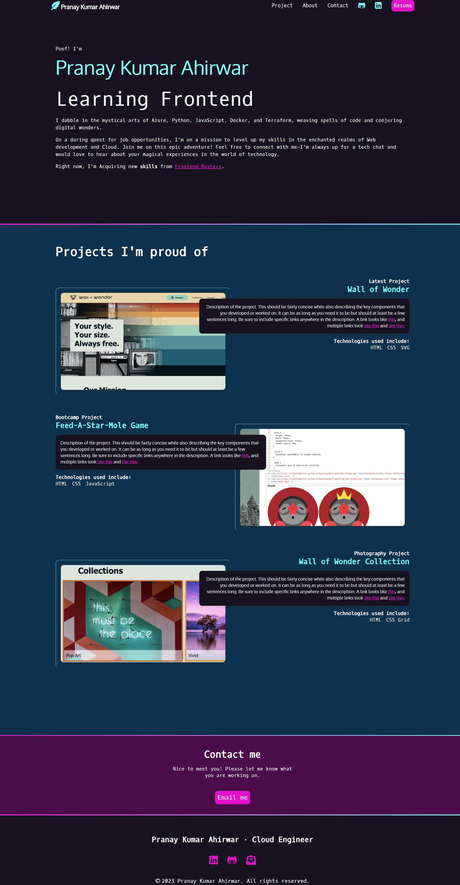
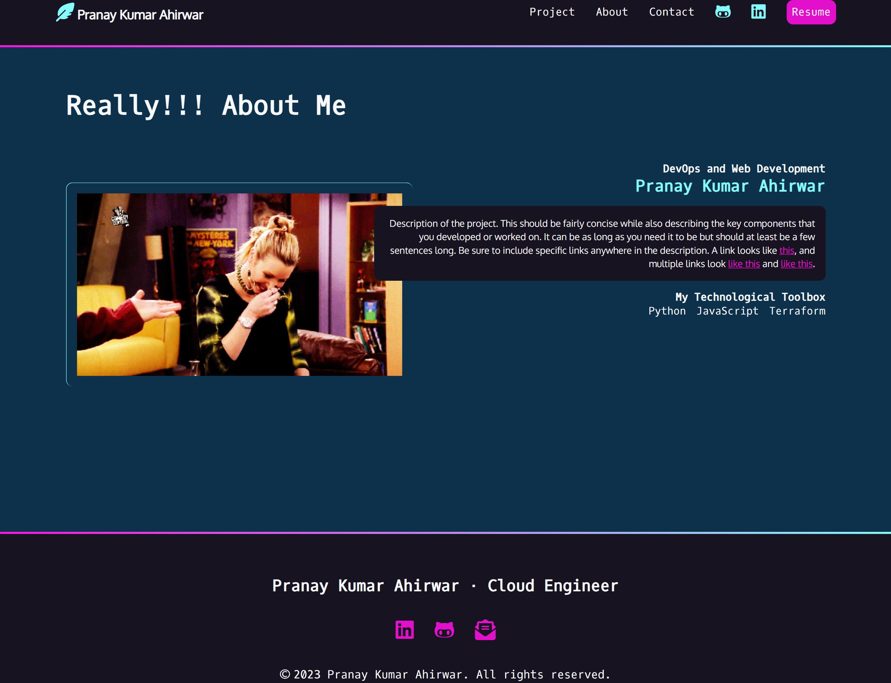

# Portfolio Website using HTML & CSS 

  
View Index Page

  
  <!-- Your content goes here -->
  

  
View About Page

  
  <!-- Your content goes here -->
  

> [!Note]
> Special thanks to Frontend Masters & Jen Karmer for  [Getting Started with CSS](https://frontendmasters.com/courses/getting-started-css/) Course for beginner